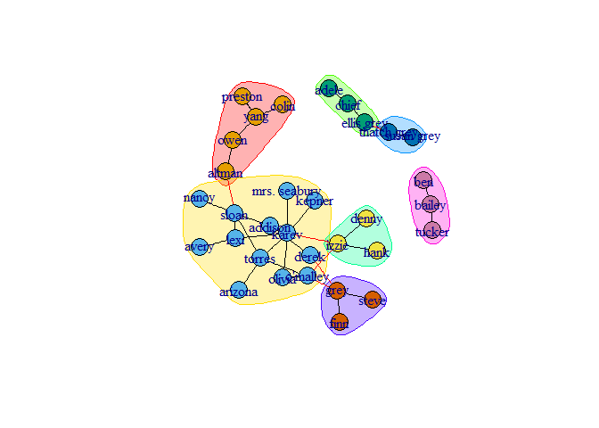
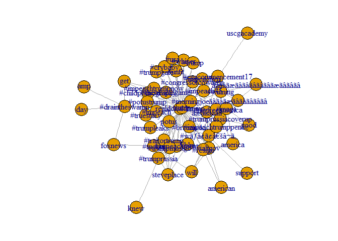

ex3
================
May 18, 2017

Exercise 3
==========

Environment setup
-----------------

``` r
folder = 'D:/Code/ex3'
setwd(folder)
```

Read Data
---------

loading the graph, using graph.data.frame to convert a dataframe representing an edgelist into an undirected graph.

``` r
library(igraph)
```

``` r
ga.data <- read.csv('ga_edgelist.csv', header = T)
g <- graph.data.frame(ga.data,directed = F)
```

1. a. Computing Centrality
--------------------------

Computing betweenes score for all nodes and printing the actor with the maximum betweeness

``` r
betweeness <- betweenness(g)
mb <- as.numeric(which(max(betweeness) == betweeness))
V(g)[mb]
```

    ## + 1/32 vertex, named:
    ## [1] sloan

**Sloan** has the highest betweeness measure

Computing closeness score for all nodes and printing the actor with the maximum closeness

``` r
closeness <- closeness(g)
mc <- as.numeric(which(max(closeness) == closeness))
V(g)[mc]
```

    ## + 1/32 vertex, named:
    ## [1] torres

**Torres** has the highest closeness measure

Computing Eigencetor score for all nodes and printing the actor with the maximum Eigencetor

``` r
evcent <- eigen_centrality(g)
vec <- evcent$vector
me <- as.numeric(which(max(vec) == vec))
V(g)[me]
```

    ## + 1/32 vertex, named:
    ## [1] karev

**Karev** has the highest Eigencetor measure

1. b. Community Detection
-------------------------

``` r
library(igraph)
ga.data <- read.csv('ga_edgelist.csv', header = T)
g <- graph.data.frame(ga.data,directed = F)
```

**using Grivan-Newman algorithm**

calculating the edges' betweenness

``` r
ebc <- edge.betweenness.community(g, directed=F)
memb<- membership(ebc)
```

calculating modularity for each merge by using a function that for each edge removed will create a second graph, check for its membership and use that membership to calculate the modularity

``` r
mods <- sapply(0:ecount(g), function(i){
  g2 <- delete.edges(g, ebc$removed.edges[seq(length=i)])
  cl <- clusters(g2)$membership
  modularity(g,cl)
  
})
```

coloring the nodes

``` r
g2<-delete.edges(g, ebc$removed.edges[seq(length=which.max(mods)-1)])
V(g)$color=clusters(g2)$membership
```

The graph

``` r
g$layout <- layout.fruchterman.reingold
plot(g)
```


``` r
sizes(ebc)
```
There are 7 communities. this is the size of each one:

    ## Community sizes
    ## 1 2 3 4 5 6 7 
    ## 8 5 4 4 5 3 3


``` r
modularity(ebc)
```

    ## [1] 0.5774221

The modularity value is 0.5774221

**using Walktrap community finding algorithm**

creating the communities using the algorithm, and returning communities object

``` r
library(igraph)
ga.data <- read.csv('ga_edgelist.csv', header = T)
g <- graph.data.frame(ga.data,directed = F)
wc <- cluster_walktrap(g)
```

the graph

``` r
plot(wc, g)
```



``` r
sizes(wc)
```
There are 7 communities. this is the size of each one:

    ## Community sizes
    ##  1  2  3  4  5  6  7 
    ##  5 13  3  3  2  3  3


``` r
modularity(wc)
```

    ## [1] 0.5147059

The modularity value is 0.5147059

2. Social Network Analysis
--------------------------

Twitter Authentication

``` r
api_key <- ""
 
api_secret <- ""
 
access_token <- ""
 
access_token_secret <- ""
```

1.  We chose twitter's API to create a semantic network based on Donald Trump's tweets. we used SocialMediaLab package to collect the tweets. In order to use the API we opened a twitter developer app.

``` r
#install.packages('SocialMediaLab')
library(SocialMediaLab)
```

authinticating to twitter API

``` r
TwitterToken <- Authenticate("twitter", apiKey=api_key, 
                          apiSecret=api_secret,
                          accessToken=access_token, 
                          accessTokenSecret=access_token_secret)
```

    ## [1] "Using direct authentication"

Collecting 100 tweets specifying the term <%22@realDonaldTrump>" into a data frame object of class dataSource.

``` r
myTwitterData<- Collect(searchTerm="@realDonaldTrump", numTweets=100, 
        writeToFile=FALSE,verbose=TRUE, credential=TwitterToken)
```

    ## Now retrieving data based on search term: @realDonaldTrump
    ## Done
    ## Cleaning and sorting the data...
    ## Done

converting the tweets' text encodign to utf-8

``` r
myTwitterData$text <- iconv(myTwitterData$text, to = 'utf-8')
```

creating a semantic network from the words found in the returned tweets.

``` r
g_twitter_actor <- Create("Semantic", dataSource=myTwitterData)
```

    ## [1] "Generating Twitter semantic network..."
    ## 
    ## Done.

``` r
gsize(g_twitter_actor)
```

    ## [1] 128

1.  there are 128 nodes in the network, each node represents a term, and each edge in the graph represents co-occurence of the terms connected to it in the same tweet.

c.plotting of the graph:

``` r
library(igraph)
par(mar = rep(2, 4))

plot(g_twitter_actor)
```



d.Computing Centrality
----------------------

1.Computing betweenes score for all nodes and printing the words with the maximum betweeness

``` r
betweeness <- betweenness(g_twitter_actor)
mb <- as.numeric(which(max(betweeness) == betweeness))

V(g_twitter_actor)[mb]
```

    ## + 2/52 vertices, named:
    ## [1] realdonaldtrump trump

**realdonaldtrump** has the highest betweeness measure

2.Computing closeness score for all nodes and printing the words with the maximum closeness

``` r
closeness <- closeness(g_twitter_actor)
mc <- as.numeric(which(max(closeness) == closeness))
V(g_twitter_actor)[mc]
```

    ## + 2/52 vertices, named:
    ## [1] realdonaldtrump trump

**realdonaldtrump** has the highest closeness measure

3.Computing Eigencetor score for all nodes and printing the words with the maximum Eigencetor

``` r
library(igraph)
evcent <- evcent(g_twitter_actor)
vec <- evcent$vector
me <- as.numeric(which(max(vec) == vec))
V(g_twitter_actor)[me]
```

    ## + 1/52 vertex, named:
    ## [1] trump

**trump** has the highest Eigencetor measure
